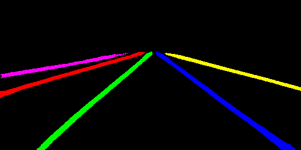

# MNN-LaneNet
Lane detection model for mobile device via MNN project. Thanks for the
great efforts of [li-qing](https://github.com/li-qing) etc.

# LaneNet-Lane-Detection
Use tensorflow to implement a Deep Neural Network for real time lane
detection mainly based on the IEEE IV conference paper "Towards
End-to-End Lane Detection: an Instance Segmentation Approach".You can
refer to their paper for details https://arxiv.org/abs/1802.05591. This
model consists of a encoder-decoder stage, binary semantic segmentation
stage and instance semantic segmentation using discriminative loss
function for real time lane detection task.

The main network architecture is as follows:

`Network Architecture`


## Installation
This project has been built and tested on Ubuntu16.04. Tests on other
platform will be done recently.

#### Common Preparation

```
1.cd ROOT_DIR && git clone https://github.com/MaybeShewill-CV/MNN-LaneNet.git
2.Download the ckpt file path here https://www.dropbox.com/sh/yndoipxt6nbhg5g/AAAPxZDDO2N0HP0YonetamJoa?dl=0
and place the ckpt file into folder ./checkpoint
```

#### Build Binary file

```
1.cd ROOT_DIR/build
2.cmake .. && make -j4
```
You will get the built executable binary file named lane_detector.out in
folder ./build if everything works correctly

#### Convert Model File

First you need to compile your own MNNConverter tools in your local
environment. Then you're supposed to modify the script for conversion in
folder ./checkpoint convert_ckpt_into_mnn_model.sh. Run the following
commands
```
cd ROOT_DIR
bash checkpoint/convert_ckpt_into_mnn_model.sh MNNConverter_TOOL_PATH
```
You may get some useful information via following command
```
cd ROOT_DIR
bash checkpoint/convert_ckpt_into_mnn_model.sh -h
```
You will get the mnn model named lanenet_model.mnn in folder ./checkpoint
if everything works correctly

## Test model

Run the following command
```
cd ROOT_DIR/build
./lanenet_detector.out ./config.ini ../data/tusimple_test_image/lanenet_test.jpg
```

The results are as follows:

`Test Input Image`


`Test Lane Binary Segmentation Image`


`Test Lane Instance Segmentation Image`



## Reference

The origin lanenet repo can be found [here](https://github.com/MaybeShewill-CV/lanenet-lane-detection).
Feel free to raise issues to help the repo become better.

## TODO
- [ ] Test the model on TX2 platform
- [ ] Add time cost profile tools to evaluate the speed on different
platform

## Acknowledgement

The lanenet project refers to the following projects:

- [Tensorflow](https://github.com/tensorflow/tensorflow)
- [MNN](https://github.com/alibaba/MNN)
- [SimpleDBSCAN](https://github.com/CallmeNezha/SimpleDBSCAN)
